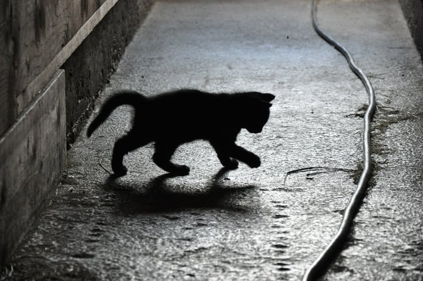
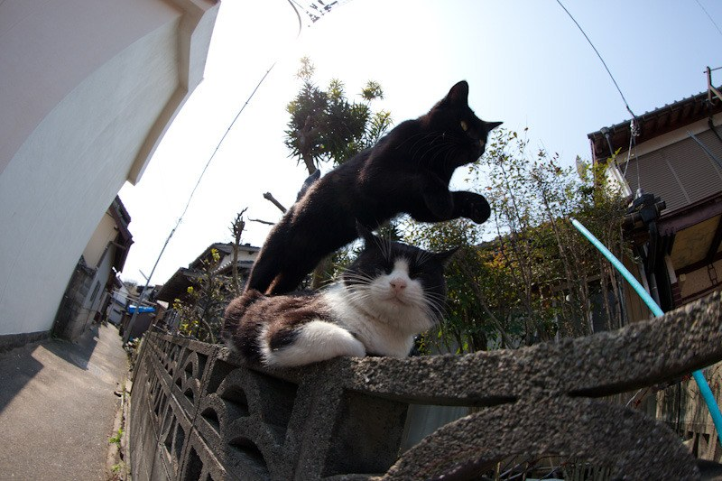
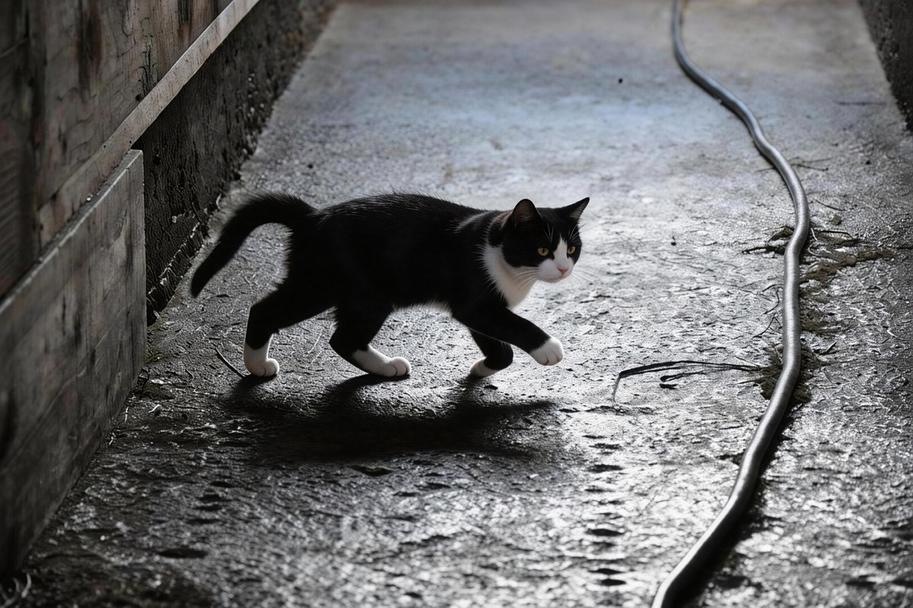

# 把表情包换成我的猫 (mycat-meme)

> 把热门表情包里的猫，换成你家猫。**静态图**和 **GIF** 都行，由 [即梦 CLI](https://github.com/<dreamina-cli-repo>) 驱动。

## 静态图替换 (`mycat-meme replace`)

<table>
  <tr>
    <td align="center"><b>原图（meme）</b></td>
    <td align="center"><b>我家猫</b></td>
    <td align="center"><b>替换后</b></td>
  </tr>
  <tr>
    <td></td>
    <td></td>
    <td></td>
  </tr>
</table>

> 演示图：左边是黑猫剪影在巷子里走的原图，中间是用户的猫照片，右边是 mycat-meme 输出——同一条巷子、同一姿势、同一光影，但猫被换成了与第二张照片里相似的黑白花猫。一次调用，约 60-90 秒。

## GIF / 视频替换 (`mycat-meme replace-gif`) — v0.2

<table>
  <tr>
    <td align="center"><b>原 GIF</b></td>
    <td align="center"><b>我家猫</b></td>
    <td align="center"><b>替换后</b></td>
  </tr>
  <tr>
    <td></td>
    <td></td>
    <td></td>
  </tr>
</table>

> v0.2 GIF 流水线：先用 `image2image` 替换首帧，再用即梦 `multimodal2video`（Seedance 2.0 系列）以原 GIF 为动作参考做整体动画化，最后转回 GIF。整个过程约 4-6 分钟。
>
> ⚠️ **已知限制**：当原 GIF 的猫是剪影或暗色场景时，视频模型容易把"新猫的外观"权重压低，回归到原视频的视觉风格。最佳效果是原 GIF 里的猫光照清晰、特征明显的情况。后续 v0.2.1 会调 prompt 改善这点。

## 这是什么

一个 Python CLI，输入一张猫咪表情包 + 一张你家猫的照片，输出一张"由你家猫主演"的同款表情包。底层完全调用即梦 CLI 的 `image2image`，所以效果跟着即梦走。

## 为什么要装即梦 CLI

这个项目本身只是个胶水层，**真正干活的是即梦 CLI**。你必须先把即梦 CLI 装好并登录，才能用 mycat-meme。

### 装即梦 CLI

```bash
# 见即梦 CLI 官方仓库的安装说明
# 安装完之后:
dreamina login --headless   # 跟着提示登录
dreamina user_credit         # 验证登录成功并查看积分
```

## 装 mycat-meme

```bash
pip install mycat-meme
# 或者从源码安装:
git clone https://github.com/BENZEMA216/mycat-meme.git
cd mycat-meme
pip install -e .
```

## 用法

### 静态图

```bash
mycat-meme replace <表情包.png> <我家猫.jpg> -o <输出.png>
```

完整选项：

```
mycat-meme replace [OPTIONS] MEME CAT

  Replace the cat in MEME with the cat photo in CAT, write to -o OUT.

Options:
  -o, --output PATH           Where to write the result.  [required]
  --style [default]           Prompt style.  [default: default]
  --poll-seconds INTEGER      Max seconds to wait inline.  [default: 180]
  --help                      Show this message.
```

### GIF

```bash
mycat-meme replace-gif <表情包.gif> <我家猫.jpg> -o <输出.gif>
```

完整选项：

```
mycat-meme replace-gif [OPTIONS] GIF CAT

  Replace the cat in GIF with the cat photo in CAT, write to -o OUT.gif.

Options:
  -o, --output PATH           Where to write the result GIF.  [required]
  --style [default]           Prompt style for first-frame replacement.
  --model [seedance2.0fast|seedance2.0|seedance2.0_vip|seedance2.0fast_vip]
                              dreamina seedance video model.  [default: seedance2.0fast]
  --duration INTEGER          Output length in seconds (4-15). Defaults to ceil(input).
  --fps INTEGER               Output GIF frame rate.  [default: 15]
  --max-width INTEGER         Output GIF max width in pixels.  [default: 600]
  --poll-seconds INTEGER      Max seconds to wait inline.  [default: 240]
  --help                      Show this message.
```

ffmpeg is required for the GIF pipeline (`brew install ffmpeg`).

## FAQ

**Q: 为什么不用 Stable Diffusion / Midjourney？**
A: 因为这个项目的目的之一是让大家用即梦 CLI。如果你想换底层模型，可以 fork 这个 repo 替换 `dreamina.py`。

**Q: 支持 GIF 吗？**
A: 支持。v0.2 加了 `mycat-meme replace-gif` 命令，基于即梦 `multimodal2video`（Seedance 2.0）。需要本地装 ffmpeg。

**Q: 替换后的猫不太像我家猫怎么办？**
A: v0.1 走的是"形象/风格替换"路线，目标是让结果"看起来像一只跟你家猫长得很像的猫"，而不是像素级身份还原。如果你需要后者，等后续版本。

**Q: 这个项目本身收钱吗？**
A: 不收。但调用即梦 CLI 会消耗你即梦账号的积分。

## 状态

- ✅ **v0.1** 开源 CLI 静态图替换（`mycat-meme replace`）
- ✅ **v0.2** 开源 CLI GIF 替换（`mycat-meme replace-gif`，基于 Seedance 2.0）

后续路线图：
- **v0.2.1** 调 prompt 改善暗色 / 剪影 GIF 的外观保持度
- **v1.0** 托管站（中文圈，微信登录 + 微信支付）
- **v1.1** 用户上传自己的表情包库

## 许可

MIT. See [LICENSE](LICENSE).

## 鸣谢

- [即梦 CLI](https://github.com/<dreamina-cli-repo>) — 干所有的脏活
- 所有原版表情包的创作者
